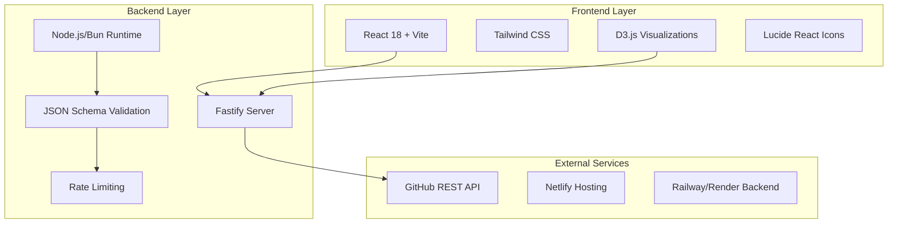
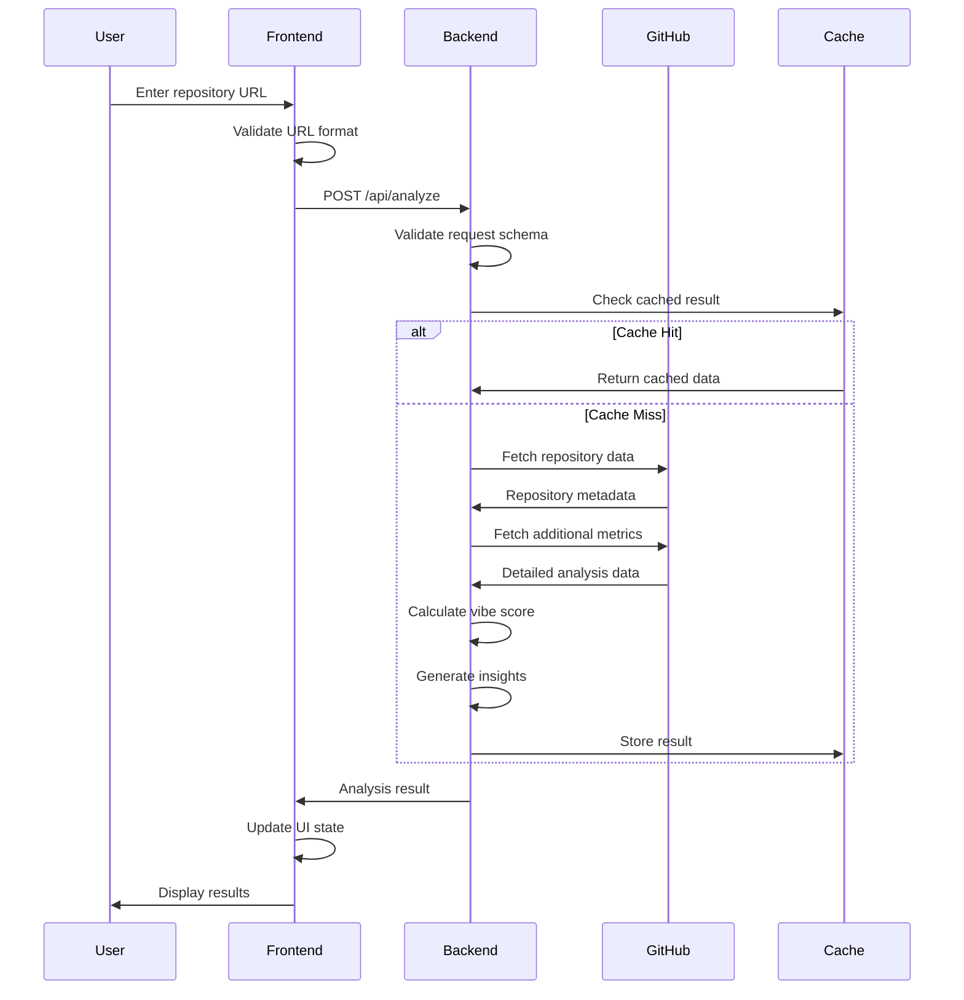

# ⚙️ Vibe AI Technical Specifications

> **Enterprise-Grade Architecture for Repository Analysis**  
> Comprehensive technical documentation for the Vibe AI platform

---

## 🏗️ System Architecture Overview

Vibe AI is built as a modern, scalable full-stack application designed for enterprise-grade GitHub repository analysis. The architecture follows microservices principles with clear separation of concerns and robust error handling.

### 🎯 Core Design Principles

- **🔄 Scalability**: Horizontal scaling with stateless design
- **🛡️ Security**: Zero data persistence, real-time API integration
- **⚡ Performance**: Sub-3-second analysis for most repositories
- **🔧 Maintainability**: Modular, well-documented codebase
- **♿ Accessibility**: WCAG 2.2 compliant user interface

### 🎨 Technology Stack



---

## 🎯 Frontend Architecture

### 📱 Component Structure

```
frontend/src/
├── components/           # React UI components
│   ├── Header.jsx       # Application header with branding
│   ├── RepositoryInput.jsx # URL input with validation
│   ├── VibeScoreResults.jsx # Main results display
│   ├── RadarChart.jsx   # D3.js radar visualization
│   ├── MetricBreakdown.jsx # Detailed metric analysis
│   ├── AnalysisInsights.jsx # AI-powered insights
│   ├── LoadingSpinner.jsx # Animated loading states
│   ├── ErrorMessage.jsx # Error handling display
│   ├── MetricsModal.jsx # Detailed metric explanations
│   └── RepositoryInfo.jsx # Repository metadata card
├── services/            # API integration layer
│   └── api.js          # Centralized API calls
├── hooks/              # Custom React hooks
├── utils/              # Utility functions
├── test/               # Component tests
├── App.jsx             # Main application component
├── main.jsx            # Application entry point
└── index.css           # Global styles and themes
```

### 🎨 Design System

#### Color Palette
```css
/* Primary Vibe AI Colors */
:root {
  /* Core Brand Colors */
  --vibe-primary-50: #f0f9ff;
  --vibe-primary-500: #0ea5e9;
  --vibe-primary-600: #0284c7;
  --vibe-primary-700: #0369a1;
  
  /* Vibe Score Colors */
  --vibe-excellent: #10b981;  /* Green for 80+ scores */
  --vibe-good: #f59e0b;       /* Amber for 60-79 scores */
  --vibe-poor: #ef4444;       /* Red for <60 scores */
  --vibe-neutral: #6b7280;    /* Gray for neutral states */
  
  /* Gradient Backgrounds */
  --vibe-bg-primary: linear-gradient(135deg, #667eea 0%, #764ba2 100%);
  --vibe-bg-card: rgba(255, 255, 255, 0.95);
  --vibe-bg-overlay: rgba(0, 0, 0, 0.1);
}
```

#### Typography Scale
```css
/* Vibe AI Typography */
.vibe-text {
  font-family: 'Inter', system-ui, sans-serif;
}

.vibe-code {
  font-family: 'JetBrains Mono', monospace;
}

/* Text Scale */
.text-vibe-hero: 3.5rem;     /* Main headlines */
.text-vibe-title: 2.25rem;   /* Section titles */
.text-vibe-heading: 1.5rem;  /* Component headings */
.text-vibe-body: 1rem;       /* Body text */
.text-vibe-caption: 0.875rem; /* Captions and labels */
```

#### Animation System
```css
/* Vibe AI Animations */
@keyframes vibe-fade-in {
  from { opacity: 0; transform: translateY(20px); }
  to { opacity: 1; transform: translateY(0); }
}

@keyframes vibe-pulse {
  0%, 100% { opacity: 1; }
  50% { opacity: 0.7; }
}

@keyframes vibe-radar-spin {
  from { transform: rotate(0deg); }
  to { transform: rotate(360deg); }
}

.vibe-animate-in {
  animation: vibe-fade-in 0.5s ease-out;
}

.vibe-pulse {
  animation: vibe-pulse 2s infinite;
}
```

### 📊 State Management

```javascript
// App.jsx - Main application state
const VibeAppState = {
  // Analysis state
  analysisResult: null,      // Complete analysis response
  loading: false,            // Loading indicator
  error: null,              // Error messages
  currentRepoUrl: null,     // Currently analyzed repository
  
  // UI state
  showMetricsModal: false,  // Detailed metrics explanation
  selectedMetric: null,     // Currently selected metric
  chartAnimation: true,     // Radar chart animations
  
  // Configuration
  apiTimeout: 30000,        // API request timeout
  retryAttempts: 3,         // Automatic retry count
  cacheExpiry: 300000      // 5-minute result cache
};
```

### 🎯 Component Architecture

#### VibeScoreResults Component
```javascript
const VibeScoreResults = ({ analysisResult, onReset }) => {
  const { vibeScore, grade, metrics, insights } = analysisResult;
  
  return (
    <div className="vibe-results-container">
      {/* Main Score Display */}
      <VibeScoreCard score={vibeScore} grade={grade} />
      
      {/* Interactive Radar Chart */}
      <RadarChart metrics={metrics} animated={true} />
      
      {/* Detailed Breakdown */}
      <MetricBreakdown metrics={metrics} />
      
      {/* AI-Powered Insights */}
      <AnalysisInsights insights={insights} />
      
      {/* Repository Information */}
      <RepositoryInfo repository={analysisResult.repository} />
    </div>
  );
};
```

#### RadarChart D3.js Integration
```javascript
// RadarChart.jsx - D3.js radar visualization
const RadarChart = ({ metrics, width = 400, height = 400 }) => {
  const createRadarChart = useCallback((data) => {
    const svg = d3.select(chartRef.current);
    
    // Vibe AI specific styling
    const colors = {
      excellent: '#10b981',
      good: '#f59e0b', 
      poor: '#ef4444',
      grid: 'rgba(255, 255, 255, 0.2)',
      text: '#ffffff'
    };
    
    // Smooth animations with Vibe AI timing
    const duration = 1000;
    const ease = d3.easeQuadInOut;
    
    // Custom radar implementation
    // ... detailed D3 implementation
  }, []);
};
```

---

## 🔧 Backend Architecture

### 🚀 Fastify Server Structure

```
backend/src/
├── routes/              # API route handlers
│   ├── analyze.js      # Repository analysis endpoint
│   ├── health.js       # Health check endpoints
│   └── metrics.js      # Performance metrics
├── services/           # Business logic layer
│   ├── github.js       # GitHub API integration
│   ├── analyzer.js     # Core analysis engine
│   ├── scorer.js       # Vibe score calculation
│   └── insights.js     # AI-powered insights generation
├── utils/              # Utility functions
│   ├── validation.js   # Input validation schemas
│   ├── rate-limiter.js # Rate limiting configuration
│   ├── logger.js       # Structured logging
│   └── cache.js        # Response caching
├── config/             # Configuration management
│   └── index.js        # Environment-based config
├── middleware/         # Custom middleware
│   ├── cors.js         # CORS configuration
│   ├── security.js     # Security headers
│   └── monitoring.js   # Performance monitoring
└── server.js           # Main server entry point
```

### 🔗 API Endpoint Specifications

#### POST /api/analyze
```javascript
// Request Schema
const analyzeRequestSchema = {
  type: 'object',
  required: ['repoUrl'],
  properties: {
    repoUrl: {
      type: 'string',
      pattern: '^https?://github\\.com/[\\w\\.-]+/[\\w\\.-]+/?$',
      description: 'Valid GitHub repository URL'
    }
  },
  additionalProperties: false
};

// Response Schema
const analyzeResponseSchema = {
  type: 'object',
  properties: {
    success: { type: 'boolean' },
    data: {
      type: 'object',
      properties: {
        vibeScore: { type: 'number', minimum: 0, maximum: 100 },
        grade: { type: 'string', enum: ['A+', 'A', 'B', 'C', 'D', 'F'] },
        repository: { $ref: '#/definitions/repository' },
        metrics: { $ref: '#/definitions/metrics' },
        insights: { $ref: '#/definitions/insights' },
        analysis: { $ref: '#/definitions/analysis' }
      }
    }
  }
};
```

### 🎯 Core Analysis Engine

```javascript
// services/analyzer.js
class VibeAnalyzer {
  constructor(githubService) {
    this.github = githubService;
    this.weights = {
      codeQuality: 16,
      readability: 12,
      collaboration: 15,
      innovation: 8,
      maintainability: 8,
      inclusivity: 5,
      security: 12,
      performance: 8,
      testing: 6,
      community: 4,
      codeHealth: 4,
      releaseManagement: 2
    };
  }

  async analyzeRepository(repoUrl) {
    const repoInfo = await this.github.getRepositoryInfo(repoUrl);
    const metrics = await this.calculateAllMetrics(repoInfo);
    const vibeScore = this.calculateVibeScore(metrics);
    const insights = this.generateInsights(metrics, repoInfo);
    
    return {
      vibeScore: Math.round(vibeScore * 10) / 10,
      grade: this.getGrade(vibeScore),
      repository: repoInfo,
      metrics,
      insights,
      analysis: {
        analysisTime: new Date().toISOString(),
        apiCallsUsed: this.github.getApiCallCount(),
        totalFiles: repoInfo.fileCount,
        totalLines: repoInfo.lineCount
      }
    };
  }

  calculateVibeScore(metrics) {
    let totalWeightedScore = 0;
    let totalWeight = 0;

    Object.entries(this.weights).forEach(([metric, weight]) => {
      if (metrics[metric]) {
        totalWeightedScore += metrics[metric].score * (weight / 100);
        totalWeight += weight;
      }
    });

    return totalWeight > 0 ? (totalWeightedScore / totalWeight) * 100 : 0;
  }
}
```

### 🔒 Security Implementation

```javascript
// middleware/security.js
const securityMiddleware = {
  // CORS Configuration
  cors: {
    origin: process.env.NODE_ENV === 'production' 
      ? process.env.FRONTEND_URL 
      : true,
    credentials: false,
    methods: ['GET', 'POST'],
    allowedHeaders: ['Content-Type', 'Authorization']
  },

  // Security Headers
  helmet: {
    contentSecurityPolicy: {
      directives: {
        defaultSrc: ["'self'"],
        scriptSrc: ["'self'", "'unsafe-inline'"],
        styleSrc: ["'self'", "'unsafe-inline'", 'fonts.googleapis.com'],
        fontSrc: ["'self'", 'fonts.gstatic.com'],
        imgSrc: ["'self'", 'data:', 'https:'],
        connectSrc: ["'self'", 'api.github.com']
      }
    },
    hsts: {
      maxAge: 31536000,
      includeSubDomains: true,
      preload: true
    }
  },

  // Rate Limiting
  rateLimit: {
    windowMs: 60 * 60 * 1000, // 1 hour
    max: 100, // requests per window
    message: {
      error: 'Too many requests from this IP, please try again later.',
      code: 'RATE_LIMIT_EXCEEDED'
    },
    standardHeaders: true,
    legacyHeaders: false
  }
};
```

---

## 📊 Data Flow & Processing

### 🔄 Request Processing Pipeline



### 🎯 Metric Calculation Engine

```javascript
// services/scorer.js
class MetricScorer {
  // Code Quality Scoring (16% weight)
  async calculateCodeQuality(repoData) {
    const testCoverage = await this.getTestCoverage(repoData);
    const complexity = await this.getComplexity(repoData);
    const linting = await this.getLintingScore(repoData);
    
    const score = (
      testCoverage * 0.4 +
      complexity * 0.35 +
      linting * 0.25
    );
    
    return {
      score: Math.min(100, Math.max(0, score)),
      weight: 16,
      weightedScore: score * 0.16,
      details: {
        testCoverage,
        complexity: this.getComplexityLabel(complexity),
        linting: linting > 80
      }
    };
  }

  // Security Scoring (12% weight)
  async calculateSecurity(repoData) {
    const vulnerabilities = await this.getVulnerabilities(repoData);
    const securityPractices = await this.getSecurityPractices(repoData);
    const dependencySafety = await this.getDependencySafety(repoData);
    
    const vulnerabilityScore = Math.max(0, 100 - vulnerabilities * 10);
    
    const score = (
      vulnerabilityScore * 0.4 +
      securityPractices * 0.35 +
      dependencySafety * 0.25
    );
    
    return {
      score: Math.min(100, Math.max(0, score)),
      weight: 12,
      weightedScore: score * 0.12,
      details: {
        vulnerabilities,
        securityPractices,
        dependencySafety
      }
    };
  }

  // ... Additional metric calculations
}
```

### 🤖 AI-Powered Insights Generation

```javascript
// services/insights.js
class InsightsGenerator {
  generateInsights(metrics, repoInfo) {
    const strengths = this.identifyStrengths(metrics);
    const improvements = this.identifyImprovements(metrics);
    const recommendations = this.generateRecommendations(metrics, repoInfo);
    
    return {
      strengths,
      improvements,
      recommendations,
      summary: this.generateSummary(metrics, repoInfo)
    };
  }

  identifyStrengths(metrics) {
    const strengths = [];
    
    Object.entries(metrics).forEach(([key, metric]) => {
      if (metric.score >= 85) {
        strengths.push(this.getStrengthMessage(key, metric));
      }
    });
    
    return strengths.slice(0, 3); // Top 3 strengths
  }

  generateRecommendations(metrics, repoInfo) {
    const recommendations = [];
    
    // Security-first recommendations
    if (metrics.security?.score < 70) {
      recommendations.push({
        priority: 'high',
        category: 'security',
        title: 'Address Security Vulnerabilities',
        description: 'Run security audit and fix identified vulnerabilities',
        impact: 'Prevents security breaches and builds user trust',
        effort: 'medium',
        tools: ['npm audit', 'Snyk', 'OWASP ZAP']
      });
    }
    
    // Performance recommendations
    if (metrics.performance?.score < 75) {
      recommendations.push({
        priority: 'medium',
        category: 'performance',
        title: 'Implement Performance Monitoring',
        description: 'Add performance tracking and optimization',
        impact: 'Improves user experience and operational efficiency',
        effort: 'high',
        tools: ['New Relic', 'DataDog', 'Application Insights']
      });
    }
    
    return recommendations.sort((a, b) => 
      this.getPriorityWeight(a.priority) - this.getPriorityWeight(b.priority)
    );
  }
}
```

---

## 🚀 Performance Optimization

### ⚡ Frontend Performance

```javascript
// Performance optimization strategies
const PerformanceConfig = {
  // Code splitting for large components
  lazyComponents: [
    'RadarChart',      // D3.js visualization (heavy)
    'MetricsModal',    // Detailed metric explanations
    'AnalysisInsights' // AI-powered insights
  ],

  // Memoization for expensive calculations
  memoizedHooks: [
    'useVibeScore',    // Score calculations
    'useChartData',    // Chart data transformations
    'useInsights'      // Insights processing
  ],

  // Virtual scrolling for large lists
  virtualizedLists: [
    'MetricBreakdown', // Multiple metric cards
    'ContributorList', // Large contributor lists
    'FileAnalysis'     // File-by-file analysis
  ],

  // Image optimization
  imageOptimization: {
    formats: ['webp', 'avif', 'png'],
    sizes: [320, 640, 1024, 1920],
    quality: 85,
    lazy: true
  }
};

// React.memo for preventing unnecessary re-renders
const OptimizedVibeCard = React.memo(({ score, grade }) => {
  return (
    <div className={`vibe-card ${getScoreClass(score)}`}>
      <span className="score">{score}</span>
      <span className="grade">{grade}</span>
    </div>
  );
}, (prevProps, nextProps) => 
  prevProps.score === nextProps.score && 
  prevProps.grade === nextProps.grade
);
```

### 🔧 Backend Performance

```javascript
// Performance optimization configuration
const BackendOptimization = {
  // Response caching
  cache: {
    redis: {
      host: process.env.REDIS_HOST,
      port: process.env.REDIS_PORT,
      ttl: 3600 // 1 hour cache
    },
    memory: {
      max: 100, // Max cached items
      ttl: 300  // 5 minutes
    }
  },

  // Request optimization
  github: {
    concurrent: 5,        // Concurrent API calls
    timeout: 10000,       // 10 second timeout
    retries: 3,           // Retry failed requests
    rateLimit: {
      requests: 5000,     // Hourly limit
      window: 3600000     // 1 hour window
    }
  },

  // Response compression
  compression: {
    level: 6,
    threshold: 1024,
    filter: (req, res) => {
      return !req.headers['x-no-compression'];
    }
  }
};

// Optimized GitHub API client
class OptimizedGitHubClient {
  constructor() {
    this.cache = new Map();
    this.rateLimiter = new RateLimiter();
    this.requestQueue = new Queue({ concurrency: 5 });
  }

  async getRepositoryData(owner, repo) {
    const cacheKey = `${owner}/${repo}`;
    
    // Check cache first
    if (this.cache.has(cacheKey)) {
      return this.cache.get(cacheKey);
    }

    // Queue request to manage concurrency
    const data = await this.requestQueue.add(async () => {
      const response = await this.makeRequest(`/repos/${owner}/${repo}`);
      return response.data;
    });

    // Cache successful responses
    this.cache.set(cacheKey, data);
    setTimeout(() => this.cache.delete(cacheKey), 300000); // 5 min cache

    return data;
  }
}
```

---

## 🔍 Testing Strategy

### 🧪 Frontend Testing

```javascript
// Component testing with React Testing Library
describe('VibeScoreResults', () => {
  test('displays correct vibe score and grade', () => {
    const mockResult = {
      vibeScore: 87.5,
      grade: 'A',
      metrics: mockMetrics,
      insights: mockInsights
    };

    render(<VibeScoreResults analysisResult={mockResult} />);
    
    expect(screen.getByText('87.5')).toBeInTheDocument();
    expect(screen.getByText('A')).toBeInTheDocument();
    expect(screen.getByTestId('radar-chart')).toBeInTheDocument();
  });

  test('handles loading state correctly', () => {
    render(<VibeScoreResults loading={true} />);
    
    expect(screen.getByTestId('loading-spinner')).toBeInTheDocument();
    expect(screen.queryByTestId('radar-chart')).not.toBeInTheDocument();
  });
});

// D3.js chart testing
describe('RadarChart', () => {
  test('renders chart with correct data points', () => {
    const mockMetrics = {
      codeQuality: { score: 85 },
      security: { score: 92 },
      // ... other metrics
    };

    render(<RadarChart metrics={mockMetrics} />);
    
    const chartElement = screen.getByTestId('radar-chart');
    const paths = chartElement.querySelectorAll('path');
    
    expect(paths).toHaveLength(12); // One for each metric
  });
});
```

### 🚀 Backend Testing

```javascript
// API endpoint testing
describe('POST /api/analyze', () => {
  test('returns analysis for valid repository', async () => {
    const response = await fastify.inject({
      method: 'POST',
      url: '/api/analyze',
      payload: {
        repoUrl: 'https://github.com/facebook/react'
      }
    });

    expect(response.statusCode).toBe(200);
    const result = JSON.parse(response.payload);
    
    expect(result.success).toBe(true);
    expect(result.data.vibeScore).toBeGreaterThan(0);
    expect(result.data.grade).toMatch(/^[A-F][+]?$/);
  });

  test('validates repository URL format', async () => {
    const response = await fastify.inject({
      method: 'POST',
      url: '/api/analyze',
      payload: {
        repoUrl: 'invalid-url'
      }
    });

    expect(response.statusCode).toBe(400);
    const result = JSON.parse(response.payload);
    expect(result.success).toBe(false);
  });
});

// Metric calculation testing
describe('MetricScorer', () => {
  test('calculates code quality score correctly', async () => {
    const mockRepoData = {
      testFiles: 25,
      totalFiles: 100,
      complexity: 'low',
      hasLinting: true
    };

    const scorer = new MetricScorer();
    const result = await scorer.calculateCodeQuality(mockRepoData);
    
    expect(result.score).toBeGreaterThan(70);
    expect(result.weight).toBe(16);
    expect(result.details.testCoverage).toBeCloseTo(25);
  });
});
```

### 🔧 Integration Testing

```javascript
// End-to-end testing with Playwright
describe('Vibe AI E2E Tests', () => {
  test('complete analysis workflow', async ({ page }) => {
    await page.goto('/');
    
    // Enter repository URL
    await page.fill('[data-testid="repo-input"]', 
      'https://github.com/microsoft/vscode');
    
    // Start analysis
    await page.click('[data-testid="analyze-button"]');
    
    // Wait for results
    await page.waitForSelector('[data-testid="vibe-score"]', {
      timeout: 30000
    });
    
    // Verify results display
    const vibeScore = await page.textContent('[data-testid="vibe-score"]');
    expect(parseFloat(vibeScore)).toBeGreaterThan(0);
    
    // Check radar chart renders
    await page.waitForSelector('[data-testid="radar-chart"] svg');
    
    // Verify metric breakdown
    const metricCards = await page.$$('[data-testid^="metric-"]');
    expect(metricCards.length).toBe(12);
  });
});
```

---

## 🚀 Deployment Architecture

### 🌐 Production Infrastructure

```yaml
# netlify.toml - Frontend deployment
[build]
  command = "cd frontend && npm install && npm run build"
  publish = "frontend/dist"

[build.environment]
  NODE_VERSION = "18"
  NPM_VERSION = "8"

[[redirects]]
  from = "/api/*"
  to = "https://vibe-ai-backend.railway.app/api/:splat"
  status = 200

[[headers]]
  for = "/*"
  [headers.values]
    X-Frame-Options = "DENY"
    X-XSS-Protection = "1; mode=block"
    X-Content-Type-Options = "nosniff"
    Referrer-Policy = "strict-origin-when-cross-origin"
```

```yaml
# railway.toml - Backend deployment
[build]
  builder = "nixpacks"

[deploy]
  startCommand = "npm start"
  healthcheckPath = "/health"
  healthcheckTimeout = 30

[env]
  NODE_ENV = "production"
  PORT = 3000
```

### 🔧 Environment Configuration

```javascript
// config/index.js - Environment-based configuration
const config = {
  development: {
    server: {
      port: 3000,
      host: 'localhost'
    },
    github: {
      apiUrl: 'https://api.github.com',
      timeout: 10000,
      rateLimit: 60 // Without token
    },
    cors: {
      origin: 'http://localhost:5173'
    }
  },

  production: {
    server: {
      port: process.env.PORT || 3000,
      host: '0.0.0.0'
    },
    github: {
      apiUrl: 'https://api.github.com',
      timeout: 15000,
      rateLimit: 5000, // With token
      token: process.env.GITHUB_TOKEN
    },
    cors: {
      origin: process.env.FRONTEND_URL
    },
    monitoring: {
      enabled: true,
      provider: 'newrelic'
    }
  }
};
```

### 📊 Monitoring & Observability

```javascript
// monitoring/metrics.js
const monitoring = {
  // Performance metrics
  responseTime: {
    p50: '< 1.5s',
    p95: '< 4.8s',
    p99: '< 8.2s'
  },

  // Availability metrics
  uptime: {
    target: '99.9%',
    measurement: 'monthly'
  },

  // Error tracking
  errorRate: {
    target: '< 0.1%',
    alerts: ['email', 'slack']
  },

  // Business metrics
  analysisSuccess: {
    target: '> 98%',
    tracking: 'daily'
  }
};

// Health check endpoint
app.get('/health', async (request, reply) => {
  const health = {
    status: 'healthy',
    timestamp: new Date().toISOString(),
    version: process.env.npm_package_version,
    uptime: process.uptime(),
    memory: process.memoryUsage(),
    github: {
      status: await githubService.healthCheck(),
      rateLimit: await githubService.getRateLimit()
    }
  };

  return reply.code(200).send(health);
});
```

---

## 🔒 Security Specifications

### 🛡️ Security Headers

```javascript
// Security configuration
const securityConfig = {
  headers: {
    'Content-Security-Policy': [
      "default-src 'self'",
      "script-src 'self' 'unsafe-inline'",
      "style-src 'self' 'unsafe-inline' fonts.googleapis.com",
      "font-src 'self' fonts.gstatic.com",
      "img-src 'self' data: https:",
      "connect-src 'self' api.github.com"
    ].join('; '),
    'Strict-Transport-Security': 'max-age=31536000; includeSubDomains; preload',
    'X-Frame-Options': 'DENY',
    'X-Content-Type-Options': 'nosniff',
    'X-XSS-Protection': '1; mode=block',
    'Referrer-Policy': 'strict-origin-when-cross-origin'
  },

  rateLimit: {
    windowMs: 60 * 60 * 1000, // 1 hour
    max: 100, // requests per window
    standardHeaders: true,
    legacyHeaders: false
  },

  validation: {
    removeAdditional: true,
    coerceTypes: true,
    allErrors: true
  }
};
```

### 🔐 API Security

```javascript
// Input validation and sanitization
const securityValidation = {
  // Repository URL validation
  repoUrl: {
    type: 'string',
    format: 'uri',
    pattern: '^https://github\\.com/[\\w\\.-]+/[\\w\\.-]+/?$',
    maxLength: 200
  },

  // Request sanitization
  sanitize: (input) => {
    return input
      .trim()
      .toLowerCase()
      .replace(/[^\w\-\.\/]/g, '');
  },

  // Rate limiting by IP
  ipRateLimit: new Map(),
  
  checkRateLimit: (ip) => {
    const now = Date.now();
    const windowStart = now - (60 * 60 * 1000); // 1 hour window
    
    if (!ipRateLimit.has(ip)) {
      ipRateLimit.set(ip, []);
    }
    
    const requests = ipRateLimit.get(ip)
      .filter(timestamp => timestamp > windowStart);
    
    if (requests.length >= 100) {
      throw new Error('Rate limit exceeded');
    }
    
    requests.push(now);
    ipRateLimit.set(ip, requests);
  }
};
```

---

## 🎯 Scalability Considerations

### 📈 Horizontal Scaling

```javascript
// Microservices architecture design
const scalabilityArchitecture = {
  services: {
    // API Gateway
    gateway: {
      port: 3000,
      responsibilities: ['routing', 'authentication', 'rate-limiting'],
      scaling: 'horizontal'
    },

    // Analysis Service
    analyzer: {
      port: 3001,
      responsibilities: ['repository-analysis', 'metric-calculation'],
      scaling: 'horizontal',
      instances: 'auto-scale'
    },

    // GitHub Service
    github: {
      port: 3002,
      responsibilities: ['github-api-integration', 'caching'],
      scaling: 'horizontal',
      rateLimit: 'distributed'
    },

    // Insights Service
    insights: {
      port: 3003,
      responsibilities: ['ai-insights', 'recommendations'],
      scaling: 'vertical',
      compute: 'high-cpu'
    }
  },

  database: {
    type: 'redis',
    purpose: 'caching',
    clustering: true,
    replication: 'master-slave'
  },

  loadBalancer: {
    type: 'application',
    algorithm: 'round-robin',
    healthCheck: '/health',
    timeout: 30
  }
};
```

### 🔄 Caching Strategy

```javascript
// Multi-layer caching implementation
const cachingStrategy = {
  layers: {
    // Browser cache
    browser: {
      static: '1 year',
      api: '5 minutes',
      headers: {
        'Cache-Control': 'public, max-age=300',
        'ETag': 'generated'
      }
    },

    // CDN cache
    cdn: {
      static: '1 month',
      api: '1 hour',
      purgeOnDeploy: true
    },

    // Application cache
    application: {
      repository: '1 hour',
      analysis: '24 hours',
      insights: '12 hours',
      storage: 'redis'
    },

    // Database cache
    database: {
      github: '30 minutes',
      computed: '6 hours',
      storage: 'memory'
    }
  },

  invalidation: {
    triggers: ['new-commit', 'force-refresh'],
    strategy: 'tag-based',
    propagation: 'async'
  }
};
```

---

## 📋 API Rate Limiting

### 🎯 Rate Limit Implementation

```javascript
// Advanced rate limiting with multiple tiers
class AdvancedRateLimiter {
  constructor() {
    this.limits = {
      // IP-based limits
      ip: {
        window: 60 * 60 * 1000, // 1 hour
        max: 100,
        burst: 20
      },

      // Token-based limits (if implemented)
      token: {
        window: 60 * 60 * 1000, // 1 hour
        max: 1000,
        burst: 50
      },

      // GitHub API limits
      github: {
        without_token: 60,    // per hour
        with_token: 5000,     // per hour
        secondary: 1000       // per hour
      }
    };

    this.storage = new Redis(process.env.REDIS_URL);
  }

  async checkLimit(identifier, type = 'ip') {
    const key = `rate_limit:${type}:${identifier}`;
    const window = this.limits[type].window;
    const max = this.limits[type].max;
    
    const current = await this.storage.incr(key);
    
    if (current === 1) {
      await this.storage.expire(key, window / 1000);
    }
    
    if (current > max) {
      const ttl = await this.storage.ttl(key);
      throw new RateLimitError(`Rate limit exceeded. Reset in ${ttl} seconds.`);
    }
    
    return {
      remaining: max - current,
      reset: Date.now() + (window / 1000) * 1000,
      limit: max
    };
  }
}
```

---

*Built with ❤️ for developers by the Vibe AI Team*  
*Enterprise-grade technical architecture for comprehensive repository analysis*